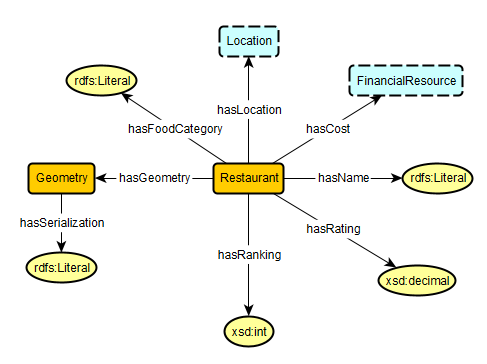
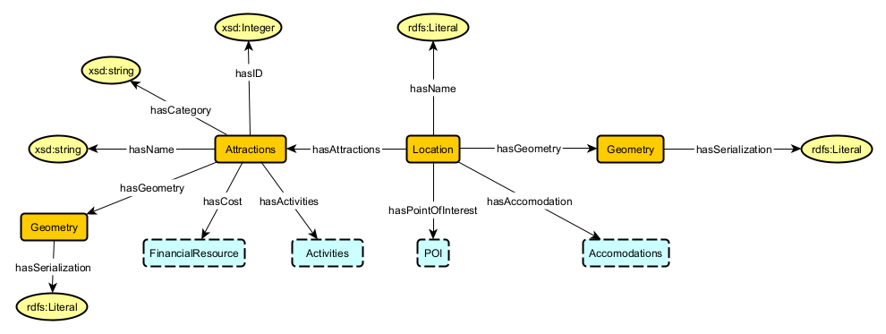

# Name of Ontology

## Accomodation

### Axioms
* `Accomodation SubClassOf hasID some xsd:integer`  
"An accomodation has an ID represented by an integer value"
* `Accomodation SubClassOf hasName some xsd:string`  
"An accomodation has a name represented by a string value"
* `Accomodation SubClassOf hasDetails some Details`  
"An accomodation has some details"
* `Accomodation SubClassOf hasReviews some Reviews`  
"An accomodation has some reviews"
* `Accomodation SubClassOf isLocatedAt exactly 1 location`  
"An accomodation has exactly one location"
* `Accomodation SubClassOf isCategory exactly 1 Category`  
"An Accomodation has a exactly one category"
* `Accomodation SubClassOf hasCost exactly 1 FinancialResource`  
"An accomodation has exactly one cost of FinancialResource"
* `Accomodation SubClassOf hasGeometry exactly 1 Geometry`  
"An accomodation has exactly one geometry"
* `Geometry SubClassOf hasSerialization some rdsf:Literal`  
"A geometry has a serialization represented by some rdsf:Literal"

## Activities

### Axioms
* `Activities SubClassOf hasCost exactly 1 FinancialResource`  
"Activities have a cost of exactly one FinancialResource"
* `Activities SubClassOf hasName some xsd:string`  
"Activities have a name that is represented by some xsd:string"
* `Activities SubClassOf atLocation exactly 1 location`  
"Activities have exactly one location"
* `Activities SubClassOf hasType Outdoor/Indoor`  
"Activities have a type that is either Indoor or Outdoor"
* `Type SubClassOf isOutdoor exactly 1 Outdoor`  
"If type is Outdoor then the type is represented by Outdoor"
* `Type SubClassOf isIndoor exactly 1 Indoor`  
"If type is Indoor then the type is represented by Indoor"

## Financial Resource

### Axioms
* `axiom in manchester syntax`  
natural language description
* `axiom in manchester syntax`  
natural language description

## Food

### Axioms
* `Food/Restaurant SubClassOf hasRanking some xsd:int`  
"A Restaurant/Food has a ranking represented by an integer value"
* `Restaurant/Food SubClassOf hasName some rdfs:Literal`  
"A Restaurant/Food has a name represented by a string value"
* `Restaurant/Food SubClassOf hasRating some xsd:Decimal`  
"A Restaurant/Food has some rating represented by a decimal value"
* `Restaurant/Food SubClassOf hasFoodCategory some rdfs:Literal`  
"A Restaurant/Food has some Food Category represented by a string value"
* `Restaurant/Food SubClassOf isLocatedAt exactly 1 location`  
"A Restaurant/Food has exactly one location"
* `Restaurant/Food SubClassOf hasCost exactly 1 FinancialResource`  
"A Restaurant/Food has exactly one cost of FinancialResource"
* `Restaurant/Food SubClassOf hasGeometry exactly 1 Geometry`  
"A Restaurant/Food has exactly one geometry"
* `Geometry SubClassOf hasSerialization some rdsf:Literal`  
"A geometry has a serialization represented by some rdsf:Literal"

## Location

### Axioms
* `axiom in manchester syntax`  
natural language description
* `axiom in manchester syntax`  
natural language description

## Transport Schema Diagram

### Axioms
* `Transport SubClassOf hasID some xsd:integer`  
"A transport has an ID represented by an integer value"
* `Transport SubClassOf hasName some xsd:string`  
"A transport has a name represented by a string value"
* `Transport SubClassOf hasDetails some Details`  
"A transport has some details"
* `Transport SubClassOf hasReviews some Reviews`  
"A transport has some reviews"
* `Transport SubClassOf isCategory exactly 1 Category`  
"A Transport has a exactly one category"
* `Transport SubClassOf hasCost exactly 1 FinancialResource`  
"A transport has exactly one cost of FinancialResource"
