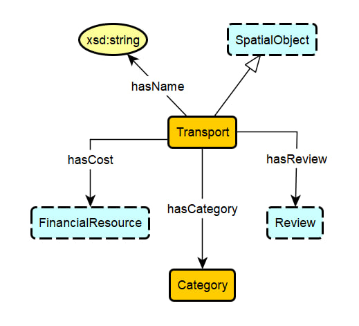
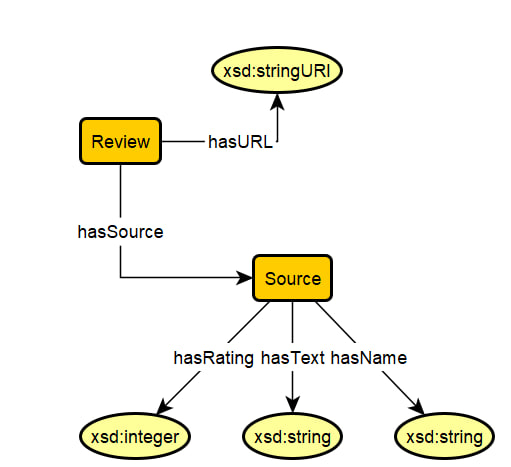

# Name of Ontology

## Accomodation

### Axioms
* `Accomodation SubClassOf hasID some xsd:integer`  
"An accomodation has max one ID represented by an integer value"
* `Accomodation SubClassOf hasName some xsd:string`  
"An accomodation has max one name represented by a string value"
* `Accomodation SubClassOf hasReview some Review`  
"An accomodation has some review"
* `Accomodation SubClassOf isLocatedAt exactly 1 location`  
"An accomodation has exactly one location"
* `Accomodation SubClassOf isCategory exactly 1 Category`  
"An Accomodation has a exactly one category"
* `Accomodation SubClassOf hasCost exactly 1 FinancialResource`  
"An accomodation has exactly one cost of FinancialResource"
* `Accomodation SubClassOf isA is a SpatialObject`  
"An Accomodation is of type SpatialObject"

## Activity

### Axioms
* `Activity SubClassOf hasCost exactly 1 FinancialResource`  
"Activity have a cost of exactly one FinancialResource"
* `Activity SubClassOf hasName some xsd:string`  
"Activity have a name that is represented by some string"
* `Activity SubClassOf atLocation exactly 1 location`  
"Activity have exactly one location"
* `Activity SubClassOf hasType Outdoor/Indoor`  
"Activity have a type that is either Indoor or Outdoor"
* `Type SubClassOf isOutdoor exactly 1 Outdoor`  
"If type is Outdoor then the type is represented by Outdoor"
* `Type SubClassOf isIndoor exactly 1 Indoor`  
"If type is Indoor then the type is represented by Indoor"

## Financial Resource

### Axioms
* `FinancialResource SubClassOf Currency some qudt:USD`  
"FinancialResurce has a currency represented by USD"
* `Food SubClassOf hasCost some FinancialResource`  
"Food has a cost represented by FinancialResource"
* `Activity SubClassOf hasCost some FinancialResource`  
"Activity has a cost represented by FinancialResource."
* `Housing SubClassOf hasCost some FinancialResource`  
"Housing has a cost represented by FinancialResource."
* `Transportation SubClassOf hasCost some FinancialResource`  
"Transportation has a cost represented by FinancialResource."

## Restaurant

### Axioms
* `Restaurant SubClassOf hasName some xsd:string`  
"A Restaurant has a name represented by a string value"
* `Restaurant SubClassOf hasReview some Review`  
"A Restaurant has some review"
* `Restaurant SubClassOf hasFoodCategory 0 or 1 xsd:string`  
"A Restaurant may or may not have a Food Category represented by a string value"
* `Restaurant SubClassOf isLocatedAt exactly 1 location`  
"A Restaurant has exactly one location"
* `Restaurant SubClassOf hasCost exactly 1 FinancialResource`  
"A Restaurant has exactly one cost of FinancialResource"
* `Restaurant SubClassOf isA is a SpatialObject`  
"A Restaurant is of type SpatialObject"

## Location

### Axioms
* `Attraction SubClassOf hasID some xsd:integer`  
"An attraction has max one ID represented by an integer value"
* `Attraction SubClassOf hasName some xsd:string`  
"An attraction has max one name represented by a string value"
* `Attraction SubClassOf hasReview some Review`  
"An attraction has some review"
* `Attraction SubClassOf isLocatedAt exactly 1 location`  
"An attraction has exactly one location"
* `Attraction SubClassOf isCategory exactly 1 Category`  
"An attraction has a exactly one category"
* `Attraction SubClassOf hasCost exactly 1 FinancialResource`  
"An attraction has exactly one cost of FinancialResource"
* `Attraction SubClassOf hasActivity some Activity`  
"An attraction has some activity"
* `Attraction SubClassOf isA is a SpatialObject`  
"An Attraction is of type SpatialObject"

## Transport

### Axioms
* `Transport SubClassOf hasID some xsd:integer`  
"A transport has an ID represented by an integer value"
* `Transport SubClassOf hasName some xsd:string`  
"A transport has a name represented by a string value"
* `Transport SubClassOf hasReview some Review`  
"A transport has some review"
* `Transport SubClassOf isCategory exactly 1 Category`  
"A Transport has a exactly one category"
* `Transport SubClassOf hasCost exactly 1 FinancialResource`  
"A transport has exactly one cost of FinancialResource"

## Review

### Axioms
* `Review SubClassOf hasURL some xsd:string`  
"Review has min 0 URL represented by a string URI"
* `Review SubClassOf hasSource some Source`  
"Review has min 0 Source some Source"
* `Source SubClassOf hasName some xsd:string`  
"Source has a Name represented by a string value"
* `Source SubClassOf hasText some xsd:string`  
"Source has a Text represented by a string value"
* `Source SubClassOf hasRating some xsd:integer`  
"Source has a Rating represented by an integer value"

## SpatialObject

### Axioms
* `SpatialObject type Geometry`  
"SpatialObject is of type Geometry"
* `Geometry SubClassOf asWKT some geo:wktLiteral`  
"Geometry is represented as WKT by some wktLiteral value" 
