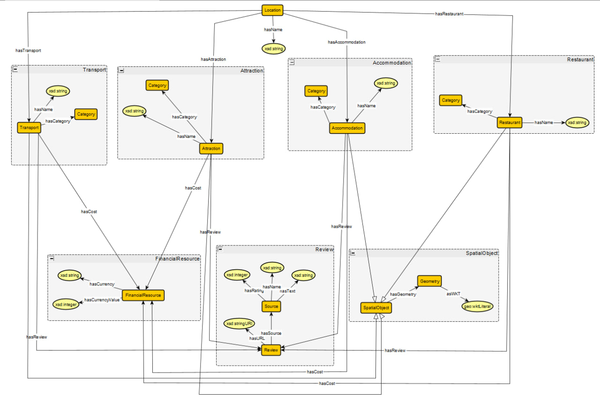
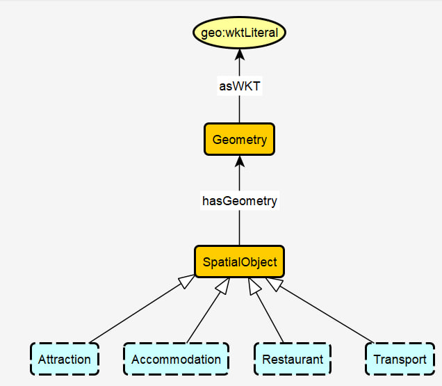

# Travel Knowledge Graph

## Accommodation

### Axioms
* `Accommodation SubClassOf hasName some xsd:string`  
"An Accommodation has max one name represented by a string value"
* `Accommodation SubClassOf hasReview some Review`  
"An Accommodation has some Review"
* `Accommodation SubClassOf hasLocation exactly 1 Location`  
"An Accommodation has exactly one Location"
* `Accommodation SubClassOf hasCategory exactly 1 Category`  
"An Accommodation has a exactly one Category"
* `Accommodation SubClassOf hasCost exactly 1 FinancialResource`  
"An Accommodation has exactly one cost of FinancialResource"
* `Accommodation SubClassOf SpatialObject`  
"Every Accommodation is a SpatialObject"

## Activity

### Axioms
* `Activity SubClassOf hasCost exactly 1 FinancialResource`  
"Activity has a cost of exactly one FinancialResource"
* `Activity SubClassOf hasName some xsd:string`  
"Activity has a name that is represented by some string value"
* `Activity SubClassOf hasLocation exactly 1 Location`  
"Activity has exactly one Location"
* `Activity SubClassOf hasEnvironment some Environment`  
"Activity has some Environment"
* `Environment SubClassOf hasType either Outdoor or Indoor`  
"Environment is either Outdoor or Indoor"

## Financial Resource

### Axioms
* `FinancialResource SubClassOf hasCurrency some xsd:string`  
"FinancialResurce has a currency represented by a string value"
* `FinancialResource SubClassOf hasCurrencyValue some xsd:integer`  
"FinancialResurce has a currency value represented by an integer value"
* `Restaurant SubClassOf hasCost some FinancialResource`  
"Restaurant has a cost represented by FinancialResource"
* `Activity SubClassOf hasCost some FinancialResource`  
"Activity has a cost represented by FinancialResource."
* `Accommodation SubClassOf hasCost some FinancialResource`  
"Accommodation has a cost represented by FinancialResource."
* `Transport SubClassOf hasCost some FinancialResource`  
"Transport has a cost represented by FinancialResource."

## Restaurant

### Axioms
* `Restaurant SubClassOf hasName some xsd:string`  
"A Restaurant has a name represented by a string value"
* `Restaurant SubClassOf hasReview some Review`  
"A Restaurant has some Review"
* `Restaurant SubClassOf hasCategory exactly 1 Category`  
"A Restaurant has exactly one Category"
* `Restaurant SubClassOf hasLocation exactly 1 Location`  
"A Restaurant has exactly one Location"
* `Restaurant SubClassOf hasCost exactly 1 FinancialResource`  
"A Restaurant has exactly one cost of FinancialResource"
* `Restaurant SubClassOf SpatialObject`  
"Every Restaurant is a SpatialObject"

## Location

### Axioms
* `Location SubClassOf hasAccommodation some Accommodation`  
"Location has some Accommodation"
* `Location SubClassOf hasRestaurant some Restaurant`  
"Location has some Restaurant"
* `Location SubClassOf hasTransport some Transport`  
"Location has some Transport"
* `Location SubClassOf hasAttraction some Attraction`  
"Location has some Attraction"
* `Location SubClassOf hasName some xsd:string`  
"Location has max one name represented by a string value"
* `Attraction SubClassOf hasName some xsd:string`  
"An Attraction has max one name represented by a string value"
* `Attraction SubClassOf hasReview some Review`  
"An Attraction has some Review"
* `Attraction SubClassOf hasCategory exactly 1 Category`  
"An Attraction has exactly one Category"
* `Attraction SubClassOf hasCost exactly 1 FinancialResource`  
"An Attraction has exactly one cost of FinancialResource"
* `Attraction SubClassOf SpatialObject`  
"Every Attraction is a SpatialObject"

## Transport

### Axioms
* `Transport SubClassOf hasName some xsd:string`  
"A Transport has a name represented by a string value"
* `Transport SubClassOf hasReview some Review`  
"A Transport has some Review"
* `Transport SubClassOf hasCategory exactly 1 Category`  
"A Transport has exactly one Category"
* `Transport SubClassOf hasCost exactly 1 FinancialResource`  
"A Transport has exactly one cost of FinancialResource"
* `Transport SubClassOf SpatialObject`  
"Every Transport is a SpatialObject"

## Review

### Axioms
* `Review SubClassOf hasURL some xsd:stringURI`  
"Review has min 0 URL represented by a string URI"
* `Review SubClassOf hasSource some Source`  
"Review has min 0 Source some Source"
* `Source SubClassOf hasName some xsd:string`  
"Source has a name represented by a string value"
* `Source SubClassOf hasText some xsd:string`  
"Source has a text represented by a string value"
* `Source SubClassOf hasRating some xsd:integer`  
"Source has a rating represented by an integer value"

## SpatialObject

### Axioms
* `SpatialObject SubClassOf hasGeometry some Geometry`  
"SpatialObject has some Geometry"
* `Geometry SubClassOf asWKT some geo:wktLiteral`  
"Geometry is represented as WKT by some wktLiteral value"
* `Transport SubClassOf SpatialObject`  
"Every Transport is a SpatialObject"
* `Attraction SubClassOf SpatialObject`  
"Every Attraction is a SpatialObject"
* `Restaurant SubClassOf SpatialObject`  
"Every Restaurant is a SpatialObject"
* `Accommodation SubClassOf SpatialObject`  
"Every Accommodation is a SpatialObject"

## Category

### Axioms
* `Transport SubClassOf hasCategory exactly 1 Category`  
"A Transport has exactly one Category"
* `Accommodation SubClassOf hasCategory exactly 1 Category`  
"An Accommodation has exactly one Category"
* `Restaurant SubClassOf hasCategory exactly 1 Category`  
"A Restaurant has exactly one Category"
* `Attraction SubClassOf hasCategory exactly 1 Category`  
"An Attraction has exactly one Category"